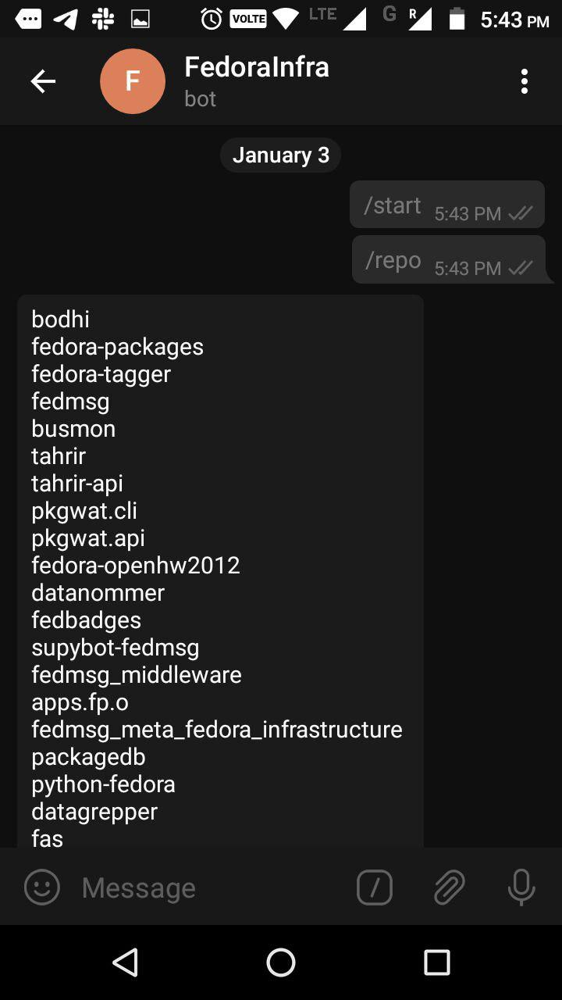

# README.md
---------------------
## Requirements

You should have your bot's **token** to get access the HTTP API which you can get from by talking to [BotFather]https://t.me/botfather 


Clone the FedrepoBot repository using the command in your terminal

```bash
$ git clone https://github.com/skr1p7/fedrepobot.git
```

You are required to have Python3 installed in order to make use of this tool, in order to install Python, use the following command:

```bash
$ sudo apt-get install python3 
```

To install the required libraries, use the following command in you terminal:

```bash
$ pip3 install -r requirements.txt
```

## Usage

```bash
python3 code.py
```

## Sample Images





**Contact developer here**
[Twitter](https://twitter.com/0xskr1p7)